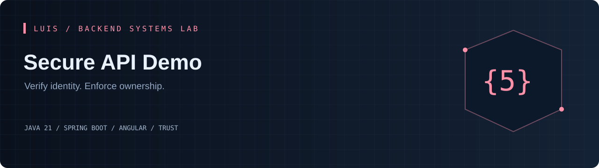
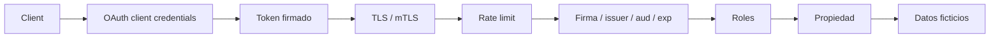

[](https://github.com/LuisDeveloper-Fer/secure-api-demo/actions/workflows/ci.yml)


[](LICENSE)

**Un JWT válido no autoriza a leer cualquier recurso. Este laboratorio separa autenticación, roles y propiedad, con perfiles TLS y mTLS para estudiar la confianza entre servicios.**

Proyecto independiente del [Backend Systems Lab de Luis](https://github.com/LuisDeveloper-Fer). Código y datos de demostración, sin información propietaria ni dinero real.

## En 60 segundos

- OAuth 2.0 Resource Server con firma, issuer, audience y expiración
- Roles reader/admin y propiedad independiente
- Bearer stateless, sin cookies de autenticación
- Rate limit global 20/s y denegación por defecto
- Perfiles TLS/mTLS y generación local de certificados

**Experimento principal:** Obtén un token de lab-reader: /api/me funciona y /api/reports devuelve 403. Con lab-admin el reporte funciona. Ninguno puede leer una cuenta con otro subject.

## Ejecutar

Requisitos: **JDK 21**, Maven 3.9+, Node 22.12+ para Angular y Docker Compose para el stack completo. [Compatibilidad de Spring Boot](https://docs.spring.io/spring-boot/system-requirements.html) · [Compatibilidad de Angular](https://angular.dev/reference/versions).

```bash
git clone https://github.com/LuisDeveloper-Fer/secure-api-demo.git
cd secure-api-demo
mvn clean package
docker compose up --build
```

| Componente | Dirección |
| --- | --- |
| Angular | http://localhost:4200 |
| API | http://localhost:8080 |
| Keycloak | http://localhost:8180 · admin / local-admin-only |

Puertos publicados solo en loopback. Ejecuta un laboratorio a la vez o cambia API_PORT/UI_PORT en el entorno.

### Desarrollo local

```bash
docker compose up -d keycloak
mvn spring-boot:run
# otra terminal:
cd frontend
npm ci
npm start
```


## Arquitectura



Keycloak emite tokens y Spring Security valida. Comprobar propiedad evita BOLA/IDOR incluso con un rol válido. CSRF se deshabilita porque no hay autenticación por cookies; esa decisión cambiaría con sesiones. mTLS autentica al cliente de transporte y no reemplaza la autorización JWT.

[Decisión técnica](docs/adr/001-design.md) · [Contrato de API](docs/api.md) · [Guion de entrevista](docs/interview.md) · [TLS y mTLS](docs/tls.md)

## Primer request

Consulta examples/requests.sh para obtener un token de Keycloak.

Ejemplo de respuesta, campos relevantes:

```json
{
  "subject": "service-account-subject",
  "roles": [
    "reader"
  ],
  "issuer": "http://localhost:8180/realms/backend-lab"
}
```

IDs y fechas cambian en cada ejecución. [Colección curl](examples/requests.sh) · [Payload JSON](examples/request.json).

## Endpoints

| Método | Ruta | Resultado |
| --- | --- | --- |
| GET | `/api/me` | Identidad; 401 inválido |
| GET | `/api/accounts/{subject}` | 200 propietario; 403 otro subject |
| GET | `/api/reports` | 200 admin; 403 reader |
| GET | `/actuator/health` | Público sin detalles |
| GET | `/actuator/prometheus` | Solo admin |

## Pruebas

```bash
mvn clean package
cd frontend && npm ci && npm run build
```

HTTP con RSA/JWKS reales: roles, propiedad, token ausente, falsificado, expirado y audiencia incorrecta. Las pruebas no necesitan Docker. CI compila Java y Angular. [Evidencia y límites de validación](docs/VALIDATION.md).

## Estructura

```text
src/main/java/dev/portfolio/
  api/              Contratos HTTP y validación
  infrastructure/   Seguridad y rate limit
src/test/           Pruebas
frontend/           Angular standalone
ops/                Entorno de ejecución
docs/               Decisiones y guía técnica
examples/           Requests reproducibles
```

## Alcance honesto

Keycloak está en modo desarrollo con credenciales de demo públicas. Rate limit por instancia, no distribuido. Flujo client_credentials; no implementa login humano con PKCE. Certificados generados válidos 30 días, solo locales. TLS/mTLS se prueban con curl, no con el panel.

Las credenciales de demo son públicas y exclusivamente locales.

## Para una entrevista

1. Reproduce el experimento principal y explica el resultado.
2. Identifica dónde termina cada transacción y qué garantiza.
3. Explica qué ocurre ante un reinicio o una solicitud duplicada.
4. Justifica qué cambiarías para operar varias instancias.

---

**LuisDeveloper-Fer** · Java Backend Developer · [Los seis laboratorios](https://github.com/LuisDeveloper-Fer) · [MIT](LICENSE)
